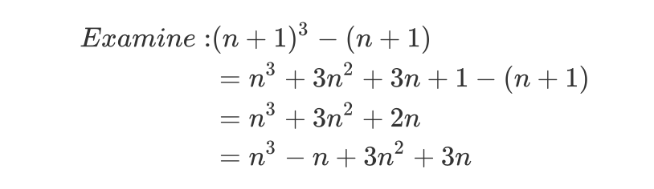
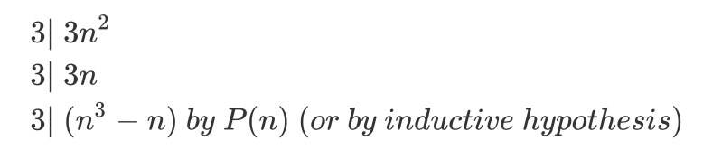
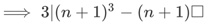
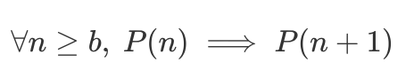
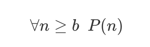
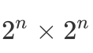

# Proof by Contradiction

To prove P is true, we assume P is False(ie,P is True) & then you use that hypothesis to derive a falsehood or contradiction.

If P is true, then   P  is false,  and this means that  P F is true.

Ex:Thm:  is **irrational**.

An irrational number is something that can't be expressed as the ratio of integers.

Proof  (by Contradiction).

Assume for the purpose of contradiction,  that  is **rational**.

  = a/b (a fraction in lowest terms,ie. a and b have no common divisors.)

 

 a is even  (2a)

 

 b is even ()

 a/b is not in lowest terms

 contradiction(※)

 is irrational.  

## Induction axiom

​		Let P(n) be a predicate. If P(0) is true and ,(P(n)P(n+1)) is true, then ,P(n) is true.

Note: In the preceding part,  is natural number.

A easy-understanding interpretation: If P(0),P(0)P(1),P(1)P(2),.... are true

then P(0),P(1),P(2).... are true.

**Thm**: ,}{2})

If n=1, 1+2+...+n = 1

If n , 1+2+...+n=0

If n = 4, }{2})

Proof: by induction.

Let P(n) be proposition that }{2})

**BaseCase**:  P(0) is true.

}{2})

**Inductive Step**: For ,show \implies{P(n+1)}) is true.

Assume P(n) is true, for purposes of  induction.

(ie., assume }{2}))

need to show =\frac{(n+1)(n+2)}{2})

)

}{2}+n+1)

(n+2)}{2})

We have prove that \implies{P(n+1)})

We've done everything we need to apply induction.  We've got P(0) is true, and P(n) implies P(n+1) for n bigger than or equal to zero.

**Thm**: ,, ie.  is a multiple of 3.

Ex: n = 5,  })

Proof, by induction.

Let P(n):   })

**BaseCase**: n = 0, 

**Inductive Step**: For , show \implies{P(n+1)}) is True.

Assume P(n) true, ie.  })

**Because:**

**Therefore:** 

The **key steps in induction** are always the same. You write down "proof by induction". You identify your predicate. You do the **base case**, usually n equals 0, but it could be something else. And then you do your **inductive step**.

**Base Case **  P(b)  is true.

**Inductive Step**: 

**Conclude**:	    

Let's now do a false proof using induction.

Thm(NOT!)   All horses are the same color.

Pf: by induction.

​	P(n): In any set of n horses( (n)1), the horses are all the same color.

BaseCase: P(1)   It's true since just 1 horse.

Inductive Step: Assume P(n) to prove P(n+1)

Consider **any** set of n+1 horses, H~1~,H~2~,...,H~n+1~

Then H~1~,H~2~,...H~n~  are the same color,

​		  H~2~,H~3~,...H~n+1~   are the same color,

Since color(H~1~) = color(H~2~,...H~n~) = color(H~n+1~)

 all n+1 are the same color  P(n+1) .

**Thm**:    way to tile a   region with a center square missing(for Bill).

Pf: by induction.

P(n):  way to tile a   region with any  square missing(for Bill).

Base Case: P(0) one   for bill

Inductive Step: For , assume P(n) to verify Inductive Hypothesis.

So we need to show P(n+1) is true.

Consider a 2^n+1^X2^n+1^  courtyard.

P(n)P(n+1).

