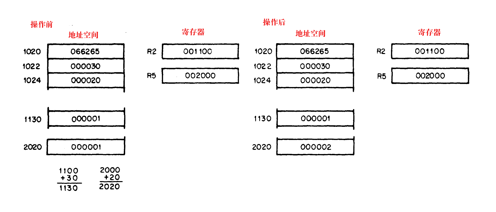

# 									目录

##### 第1章  引言

​		1.1  综述

​		1.2 通用特性

​				1.2.1  单总线

​				1.2.2  中心处理器

​				1.2.3  内存

​				1.2.4  浮点

​				1.2.5  内存管理

​		1.3 外围接口/选项

​				1.3.1  I/O设备

​				1.3.2 存储设备

​				1.3.3 总线选项

​		 1.4  软件

​				1.4.1 纸带软件

​				1.4.2 磁盘操作系统软件

​				1.4.3 高级语言

​		 1.5  数字系统

##### 第二章 系统架构

​		2.1  系统定义

​		2.2 单总线

​				2.2.1  双向线

​				2.2.2  主从关系

​				2.2.3  联锁通信

​		2.3 中心处理器

​				2.3.1 通用寄存器

​				2.3.2 处理器状态字

​				2.3.3 堆栈限制寄存器

​		2.4  扩展指令集 & 浮点

​		2.5  核心内存

​		2.6 自动优先级中断

​				2.6.1 使用中断

​				2.6.2 中断过程

​				2.6.3 中断服务

​		2.7 处理器陷阱

​				2.7.1 电源故障

​				2.7.2 奇怪的寻址错误

​				2.7.3 超时错误

​				2.7.4 保留指令

​				2.7.5 陷阱处理

##### 第三章   寻址模式

​			[3.1 单操作数寻址](#single_operand_addr)

​			[3.2  双操作数寻址](#double_operand_addr)

​			[3.3  直接寻址](#direct_addr)

​					[3.3.1 寄存器模式](#register_mode)

​					[3.3.2 自动增量模式](#autoincrement_mode)

​					[3.3.3 自动减量模式](#autodecrement_mode)

​					[3.3.4  索引模式](#index_mode)

​			[3.4 延迟(间接)寻址](#deferred_addressing)

​			 [3.5 把PC用作通用寄存器](#pc_as_general_register)

​					[3.5.1 立即模式](#immediate_mode)

​					[3.5.2  绝对寻址](#absolute_addressing)

​					[3.5.3 相对寻址](#relative_addressing)

​					[3.5.4 相对延迟寻址](#relative_deferred_addressing)

​				3.6  把堆栈指针作为通用寄存器使用

​				3.7 寻址模式总结

​					3.7.1 通用寄存器寻址

​					3.7.2 程序计数器寻址

##### 第四章  指令集

​			4.1 介绍

​			4.2 指令格式

​			4.3 指令列表

​			4.4 单操作数指令

​			4.5 双操作数指令

​			4.6 程序控制指令

​			4.7 杂项

##### 第五章   编程技巧

​			5.1 堆栈

​			5.2 子例程连接

​					5.2.1 子例程调用

​					5.2.2 参数传输

​					5.2.3 子例程返回

​					5.2.4 PDP-11子例程优势

​			 5.3 中断

​					5.3.1 通用原则

​					5.3.2 嵌套

​			 5.4 重入

​			 5.5 位置无关代码

​			 5.6 协同例程

​			 5.7 多道程序设计

​					5.7.1 控制信息

​					5.7.2 数据

​					5.7.3 处理器状态字

##### 第六章  内存管理

​				6.1 PDP-11家族基本寻址逻辑

​				6.2 虚拟寻址

​				6.3 管理控制下的中断情形

​				6.4 物理地址的构建

​				6.5 管理寄存器

​					  6.5.1 页面地址寄存器

​					  6.5.2 页面描述符寄存器

​				6.6 错误寄存器

​					 6.6.1 状态寄存器   #0

​					 6.6.2  状态寄存器  #2

##### 第七章  内部处理器选项

​				7.1 综述

​				7.2 EIS 选项

​				7.3 浮点选项

​				7.4 堆栈限制选项

##### 第八章  控制台操作

​				8.1 控制台元素

​				8.2 状态指示器

​				8.3 控制台开关

​				8.4 显示器

##### 第九章 规格

​				9.1 封装

​				9.2 CPU操作规范

​				9.3 其他设备

​				9.4 计算机的PDP-11家族

##### 附录A		指令集处理器

##### 附录B		内存映射

##### 附录C        PDP-11/40指令时序

##### 附录D		指令索引和数值操作码列表

##### 附录E		PDP11指定总结

## 第一章

## 引言

### 1.1综述

​	  **PDP-11家族**包含一些**中央处理器**，许多**外围设备**和**选项**，以及**扩展软件**。PDP-11计算机有相似的架构，其软硬件都向上兼容，虽然每个机器都有它独有的一些特性。新系统将和现有的家族成员兼容。用户可以选择最适用于其应用的系统，但当需求改变或增加时，他可以轻易地新增或改变硬件。

​	  本手册描述了PDP-11/40——来自数字设备公司(DEC)PDP-11家族的最新款计算机。这一强大的、便宜的机器，包装在21英寸的前面板滑动底架上，当将其安装在一个标准的机架上时，允许方便地使用和扩展。PDP-11/40被设计用来满足一个宽范围的应用，从小型单机情形——此时计算机只由8K的内存和一个处理器组成；到大型多用户、多任务的应用——需要多达124K的**可寻址内存空间**。它的主要特性包括，可以选择浮点和复杂内存管理(这两个都是硬件选项)的快速中央处理器。

PDP-11/40的一些特性:

- 16位的字(两个8位字节)

  直接寻址32K的16位字或64K的8位字节(K=1024)。

- 字或字节处理

​         非常高效地处理8位字符

- 异步操作

​       系统以它们的最高可能速度运行，用更快的设备替换意味着更快的操作，而无需改变其他硬件或软件。

- 模块化组件设计

  配置系统非常容易和灵活

- 堆栈处理

  硬件序列化内存操作使得处理结构化数据、子例程和中断变得容易。

- 8位快速通用寄存器

  用于指令处理的非常快速的集成电路

- 自动优先级处理

  四线，多级系统是动态可改变的

- 矢量中断

  无需设备轮询的快速中断响应

- 单&双操作数指令

  微编程指令的强大、快捷的集合

#### DEC引用

​	以下出版物包含补充性的有用信息:

​								**标题**

《PDP-11外围部件和接口手册》

《PDP-11单总线接口手册》

《小型计算机编程入门手册》

### 1.2   通用特性

#### 1.2.1 单总线

​		所有的计**算机系统组件**和**外围设备**都连接到名为**UNIBUS**的单个高速总线，并通过该总线互相通信，这个单总线是PDP-11许多优势的关键。因为系统的所有组成部分，包括中央处理器，都通过UNIBUS以相同的形式进行彼此间的通信，所以处理器对外围设备的访问与对内存的访问一样简单。

​		有了UNIBUS上的**双向、异步通信**机制，**无需处理器干预**，设备即可**独立**地发送、接受及交换数据。例如，当中央处理单元（CPU)处理其他任务时，阴极射线管显示器可以从磁盘文件来刷新自己。因为UNIBUS是异步的，所以它可以与运行在一个较大速度范围内的所有设备相兼容。

​		发生在UNIBUS上的设备通信是互锁的。“主设备”每发出一条命令，就会收到一个响应信号，该信号来自完成该数据传输的从设备。**设备-设备通信**完全独立于**物理总线的长度**和**主从设备的响应时间**。

 		与总线相连的接口是时间无关的，不必担心脉冲宽度或上升时间限制。UNIBUS上的最大传输速率是每400纳秒一个16位字，或每秒 2,500,000个16位字。

​		直接与内存交换数据的输入/输出设备被赋予了最高优先级，还可能请求总线控制权，并在指令执行期间窃取总线和内存周期。在内存传输后，处理器立即恢复操作。通过“窃取”总线周期，多个设备可同时运行在最大直接内存访问（DMA）速率。

#### 1.2.2  中央处理器

​		作为子系统连接到UNIBUS的**中央处理器**，**控制**UNIBUS对外围部件的**时间分配**，**执行**算术、逻辑操作及指令解码。**它包含多个**可被用作累加器、地址指针、索引寄存器及其他专用用途的**高速通用寄存器**。处理器可在不干扰处理器寄存器的情形下，执行I/O设备和内存之间的直接数据转移；执行单操作数（及双操作数）寻址，并处理16位字和8位字节数据。

##### 指令集

​		指令补充利用通用寄存器的灵活性，提供了超过400个强大的硬连接指令——这是所有16位的计算机中，最为全面强大的指令集。不像传统的16位计算机，它们通常有3种指令（内存引用指令；操作或AC控制指令和I/O指令），PDP-11中的所有操作都用一套指令完成。因为**中央存储器**操作**外围设备寄存器**可以像操作**磁心存储器**一样灵活，所以用于**操作磁心存储器数据**的指令，也可被很好地应用于**外围设备寄存器数据**的操作。例如，**CPU**可直接测试或修改**外部设备寄存器**中的数据，而无需将其**写入内存**或**干扰通用寄存器**。可以直接将数据添加到**外围设备寄存器**，或用掩码和分支在逻辑或算术上比较内容。因此所有的PDP-11指令都可被用于处理**计算机I/O**，而无需一种特殊的I/O操作指令。

​		PDP-11的**基本顺序码**将单操作数和双操作数地址指令**都用于**处理字或字节。因此PDP-11可非常高效地用一条指令完成诸如此类的操作——对两个操作数进行相加或相减，或把操作数从一个位置移到另一位置。

### 							        PDP-11采用的方式

**ADD  A,B**														**将位置A储存的值加到位置B的储存值上，并将结果保存在位置B**

### 											传统方式

**LDA   A**																**将位置A储存的值加载到AC上**

**ADD B**																**将内存位置B的储存值加入到AC中**

**STA  B**																	**把结果储存在位置B中**

##### 优先级中断

​		**多级自动优先级中断系统**允许处理器自动响应系统外的条件。每一级都可以附接任意数目的独立设备。

​		PDP-11系统中的**每个外围设备**都有一个**硬件指针**指向它自己的**那对内存字**（一个指向该设备的**服务例程**；另一个包含了**新的处理器状态信息**）。有了这个唯一标识，就不用再轮询设备来识别中断了，因为在自动保存了中断程序段的状态后，**中断服务硬件**就选择和开始执行合适的**服务例程**。

​		**设备的中断优先级**和**服务例程优先级**是相互独立的。这允许通过动态改变**服务例程的优先级**，调整响应实时条件的**系统行为**。

​		**中断系统**允许处理器不断将自己的**可编程优先级**和**任意一个中断设备的优先级**相比较，并用**高于处理器优先级**的**最高级别**来确认该设备。**某个设备的中断服务**可以被打断，以服务**优先级更高**的设备。高优先级设备的服务一完成，就会自动恢复低优先级设备的服务。被称为嵌套中断服务的这一过程可嵌套至任一层级，而无需软件在每个层级保存和恢复处理器状态。

##### 可重入代码

​		中断处理硬件和子例程调用硬件都有助于编写PDP-11的**可重入代码**。这种类型的代码允许多于一个进程或任务共享给定子例程或程序的同一个副本。这减少了多任务应用程序（如许多外围设备的并发服务）所需的核心数量。

##### 寻址

​		PDP-11的许多性能都来自于其宽范围的寻址能力。PDP-11的寻址模式包括前向（或后向）顺序寻址，地址索引，间接寻址，16位字寻址、8位字节寻址和栈寻址。**变长指令格式**允许每个寻址模式使用最小数目的**位**。这导致对**程序存储空间**的高效使用。

##### 栈

​		在PDP-11中，栈是一个**临时的数据存储区域**，它允许程序**高效利用频繁访问的数据**。栈被**程序中断**、**子例程调用**和**陷阱指令**自动使用。当处理器被中断时，中央处理器状态字和程序计数器被保存到（压入）堆栈区域，而处理器则服务触发中断的设备。之后一个**新的状态字**被自动从磁芯存储器的某一区域获得，该区域是为**中断指令**保留的（矢量区域）。来自中断指令的返回恢复了**最初的程序状态**，并在没有软件干预的情形下**返回被中断的程序**。

##### 直接内存访问

​		所有的PDP-11计算机都提供了直接访问内存的功能。可以把任意数目的DMA设备附接到UNIBUS上。最高优先级被赋给了DMA设备，因此允许以内存周期速度进行内存数据储存或读取。UNIBUS的组织和逻辑使延时最小化，它在数据传输的同时对请求和优先级进行采样。

##### 电源故障和重新启动

###  The PDP·ll's power fail and restart system not only protects memory when power fails, but also allows the user to save the existing program location and status (including all dynamic registers), thus preventing harm to devices, and eliminating the need for reloading programs. Auto· matic restart is accomplished when power returns to safe operating levels, enabling remote or unattended operations of PDP·ll systems. All standard peripherals in the PDP·ll family are included in the systemized power-fail protect/restart feature.

## 第二章

### 2.1 系统定义

PDP-11/40是一个使用2的补码算法的**16位通用并行逻辑**计算机。处理器可以直接寻址**32768**个16位字或**65536**个8位字节。

**中央处理单元**执行系统所需的所有**算数和逻辑运算**。像**内存管理单元**（它通过重定位和保护提供了完整的**内存管理功能**）那样，**浮点单元**集成到了**中央处理**器里。

PDP-11/40硬件已向**多道程序环境**优化，因此处理器运行于**两种环境**(内核和用户)。

### 2.3.2 处理器状态字

**处理器状态字**(PS),位于位置**777776**处，包含有关**PDP-11/40当前状态**的信息。

此信息包括**当前处理器优先级**:当前及上一次的**操作模式**；描述**上一条指令结果**的**条件代码**；和**一个指示器**，它用于检测在程序调试期间将要**被捕获的指令**的执行。

#### **模式**(带有内存管理选项)

**模式信息**包括当前模式——**用户**或**内核**(15、14位);和在**上次中断**或**进入陷阱前**机器所处的模式(13、12位)。

通过为用户提供两种不同的**处理器堆栈集**和用于内存映射的**内存管理寄存器**，这两种模式使**多道程序系统**有了完全受保护的环境。在**用户模式**，禁止程序执行**暂停("HALT")指令**，若尝试执行这一指令，该**处理器**将通过**位置10捕获**。此外，此处理器将忽略**"重置"("RESET")指令**。在**内核模式**，处理器将执行**所有指令**。

以**内核模式**运行的程序可将用户的程序映射到**内核**中的所有位置，因此显式地保护**关键区域**(包括设备寄存器和处理器状态字)不受用户操作环境的影响。

#### 处理器优先级

**中央处理器**运行在**8个优先级**(0-7级)中的任意一级。当该CPU运行在**第7级**，外部设备不能用一个**服务请求**来中断它。为使**中断生效**，**中央处理器**必须运行在比**外部设备的请求**更低的优先级上。在处理器状态字(5-7位)维护当前优先级。这8个处理器优先级提供了一个有效的中断掩码。

#### 条件码

**条件码**包含有关**上次CPU操作结果**的信息。

这些位设置如下:

​	Z=1,若结果为零(zero)。

​	N=1,若结果为负(negative)。

​	C=1,若操作导致MSB进位(carry)。

​	V=1，若操作导致算术溢出(overflow)。

#### 陷阱

在程序的控制下，**陷阱位(T)**可被**置位**或**复位**。当**置位**时，在**指令执行完成**时，**处理器陷阱**将在**位置14**出现，并会加载一个**新处理器状态字**。该位对调试程序非常有用，因为它提供了**设置断点**的有效方法。**中断**和**陷阱指令**都自动导致前一个**处理器状态字**和**程序计数器**被保存，并被新值替换——这些新值与**服务中断**或**陷阱**的例程所需的值相对应。用户可以使**中央处理器**自动**切换模式**，或在进入**陷阱**或出现**中断**时**禁用Trap位**。

### 2.3.3 堆栈寄存器(带有内存管理选项)

所有的PDP-11在位置400处都有一个**堆栈溢出边界**。PDP-11/40里的**内核堆栈边界**，是通过位于777774位置的**堆栈限制寄存器**设置的**可变边界**。一旦**内核堆栈**超过其边界，**处理器**将完成当前指令，并**陷阱到位置4**(黄色或警告堆栈违规)。若由于某种原因，程序超过16字的限制仍继续存在，处理器将终止这一**侵犯性指令**，把4保存到堆栈点(R6),并陷阱到**位置4**(红色或致命堆栈违规)。

### 2.4 扩展指令集 & 浮点

### 2.5 核心存储

#### 存储结构

可以把**内存**视为**一系列位置**，每个位置分配有一个**编号(地址)**。因此，4096字的**PDP-11内存**可如图2-3那样展示。

因为PDP-11内存被设计为容纳16位字和8位字节，所以地址的总数目并没有与字的数目相对应。4096字内存可包含8192字节，并由017777个八进制位置组成。字始终从偶数编号位置开始。

如图2-4所示，PDP-11字被分为一个高字节和一个低字节。

低字节被存储在偶数编号的内存位置，且高字节被存储在奇数编号的内存位置。因此，可容易地查看如图2-5所示的PDP-11内存。

系统已为**中断和陷阱处理**、**处理器堆栈**、**通用寄存器**及**外围设备寄存器**保留了一些**内存位置**。**从0到 370~8~**的内核虚拟地址始终被保留，且在应用于**陷阱和中断处理**的大型系统配置上，会保留直到**777~8~**的虚拟地址。前4096字地址(从 770000~8~起)已被保留，用于通用寄存器和外围设备。

用于字节寻址的16位字，可以寻址最大32K字。然而，高4096字位置按惯例被保留，用于外围设备和寄存器地址，因此，用户有28K的内核用于编程。为把地址空间扩展到28K以上，用户必须使用**内存管理单元**。该设备提供了一个18位的有效内存地址，它允许寻址多达124K字的实际内存。该单元也提供了一个附加功能，它允许单个用户程序访问多达32K内存，并通过2组8个寄存器，提供重定位和保护的功能。

完整的16位字或8位字节的信息，可在主从之间的总线上传输。

## 第三章       寻址模式

​		必须存取并操作储存在内存中的数据。数据处理由PDP-11指令（如MOV，ADD等）所指定，它们通常表示:

- ​				功能（操作代码）

- ​				当定位源操作数（或目的操作数）时要使用的通用寄存器

- ​				寻址模式（用于指定如何使用所选寄存器）

​		因为通常由计算机所处理的大部分数据都是结构化的（如保存在字符字符串、数组、列表中的数据等），因此PDP-11已被设计为可高效、灵活地处理结构化数据。可用以下的**任意一种方式**和指令一块使用**通用寄存器**:

- 作为累加器。将要被操作的数据保存在累加器中。
- 作为指针。寄存器的内容是操作数的地址，而非操作数本身。
- 作为自动单步调试核心位置的指针。自动单步向前通过连续的核心位置被称为自动增量寻址；自动单步向后被称为自动减量寻址。这些模式在处理表格式数据时尤其有用。
- 作为索引寄存器。在这种情况下，将寄存器的内容和紧跟指令的字加起来，以生成操作数的地址。这样可以轻松地访问列表中的变量条目。

​        PDP-11也有指令寻址模式组合，它有利于临时数据存储结构，以方便处理必须被频繁存取的数据。这被称为"栈"。

​		在PDP-11中任何寄存器可在程序的控制下被用作"堆栈指针"，然而，某些与子程序链接和中断服务相关联的指令自动使用寄存器6作为"硬件堆栈指针"。因此，R6常被称为“SP”。

​		R7用作程序处理器的程序计数器（PC）。建议不把R7用作堆栈指针。

​		寄存器排布是一个重要的PDP-11/40功能，它必须与寻址模式一块考虑:

- 6个通用寄存器（R0-R5)

- 一个硬件堆栈指针（R6)

- 一个程序计数器（PC）寄存器（R7）

​        指令助记符和寻址模式符号足以编写机器语言程序。程序员不必关心将程序转化为二进制位；这由PDP-11 宏汇编器自动完成。

#### 3.1 单操作数寻址					[返回顶部](#top)

适用于所有单操作数指令（如清除，增加，测试）的指令格式如下:

从第15位到第6位指定了操作码，它定义了待执行指令的类型。

从第5位到第0位构成了一个叫做目的地址字段的6位字段。它包括两个子字段:

​	a)第0位到第2位指定了该指令字将要引用8个通用寄存器中的哪一个。

​	b)第3位到第5位指定了如何使用所选寄存器（寻址模式）。第3位表示直接或延迟（间接）寻址。

#### 3.2 双操作数寻址			[返回顶部](#top)

隐含两个操作数的操作（如加、减、移动或比较）是由指定两个地址的指令所处理的。第一个操作数被称为源操作数，第二个操作数被称为目的操作数。

源地址字段和目的地址字段中的位赋值可能指定不同的模式和不同的寄存器。双操作数指令的指令格式如下:

​		源地址字段被用于选择源操作数，第一个操作数。目的地址字段的用法相似，它定位第二个操作数及其结果。例如，指令ADD A, B 把位置A的内容（源操作数）加到位置B的内容（目的操作数）上。执行过后，B将包含求和的结果，而A的内容将保持不变。

​		本节（更进一步，本章）的示例使用以下节录的PDP-11指令：

| 助记符 | 描述                                                         | 八进制码 |
| ------ | ------------------------------------------------------------ | -------- |
| CLR    | 清除（把指定目标清零）                                       | 0050DD   |
| CLRB   | 清除字节（把指定目标中的字节清零）                           | 1050DD   |
| INC    | 增量（目标的内容加1）                                        | 0052DD   |
| INCB   | 字节增量（目标字节的内容加1）                                | 1052DD   |
| COM    | 补码（用目标内容的逻辑补码来替换它们；每个0被置位，每个1被清除） | 0051DD   |
| COMB   | 字节补码（用目标字节内容的逻辑补码来替换它们；每个0被置位，每个1被清除） | 1051DD   |
| ADD    | 求和（把源操作数加到目的操作数上，并将结果储存至目的地址）   | 06SSDD   |

DD=目的字段（6位）

SS=源字段（6位）

（）=...的内容

#### 3.3 直接寻址  				 [返回顶部](#top)

以下表格总结了直接寻址使用的4个基本模式。

### 													  直接模式

| 模式 | 名称     | 汇编器语法 | 功能                                                 |
| ---- | -------- | ---------- | ---------------------------------------------------- |
| 0    | 寄存器   | Rn         | 寄存器包含操作数                                     |
| 2    | 自动增量 | (Rn)+      | 寄存器被用作指向序列化数据的指针，然后增加           |
| 4    | 自动减量 | -(Rn)      | 寄存器被减少，然后被用作指针                         |
| 6    | 索引     | X(Rn)      | 值X被加到(Rn)上以产生操作数的地址。X和(Rn)都未修改。 |

##### 3.3.1寄存器模式

​																	OPR    Rn

在寄存器模式下，任意通用寄存器可能被用作简单累加器，且操作数包含于选中寄存器内。因为它们是处理器内的硬件寄存器，因此通用寄存器以高速运行，当其被用于操作频繁存取的变量时，有速度优势。 PDP-11汇编器把OPR Rn形式的指令解释并汇编为寄存器模式操作。Rn代表通用寄存器名称或编号，OPR代表通用指令助记符。

汇编器语法要求通用寄存器被定义如下：

R0=%0 (% 符号代表寄存器定义) 
R1=%1

R2=%2等

寄存器通常用像R0, R1, R2, R3, R4, R5, R6 和 R7一样的名称来提及。但是，R6和R7也被分别称为SP和PC。

**寄存器模式示例**

（所有数字都是八进制）

​			助记符				八进制码				指令名称

1. ​	Inc R3					005203				 增量

  操作：把通用寄存器3的内容加1

2. ADD R2,R4	    060204						求和

   操作： 把R2的内容加到R4的内容上。

   

3. COMB  R4           105104                求字节的反码

   操作：		R4寄存器中0-7位求其反码。（当使用通

   用寄存器时，字节指令只在0-7位上操作，即寄存器的第0个字节）

   

##### 3.3.2 自动增量模式

​																				OPR(Rn)+

​	这一模式使得指针可通过**操作数表的序列化元素**自动步进。它假定**选中通用寄存器**的内容是操作数的地址。步进寄存器的内容(字节的步长为1，字的步长为2，R6和R7的步长始终是2)，来寻址下一个序列化位置。**自动增量模式**对**数组处理**和**堆栈**尤其有用。它将访问表中的某个元素，然后步进该指针，以寻址表中的下一个操作数。虽然对表处理最有用，这一模式完全通用，可能被用于许多用途。

**自动增量模式示例**

​				助记符							八进制码						指令名称

1. ​	   CLR(R5)+						  005025							清除

 操作：使用R5的内容作为**操作数的地址**。清除选中操作数，然后将R5的内容加2。

2. ​     CLRB(R5)+						 105025							清除字节

  操作：使用R5的内容作为**操作数的地址**。清除**选中字节操作数**，然后将R5的内容加1。

3. ​     ADD  (R2)+,R4					062204							相加

 操作：R2的内容被用作**某操作数**的地址，**该操作数**被加到了R4的内容上。然后把R2加2。

##### 3.3.3自动减量模式

​															OPR-(Rn)

​		这种模式对反向处理列表中的数据很有用。选中通用寄存器中的内容被自动减少（字指令减2，字节指令减1），然后被用作操作数的地址。PDP-11的操作后自动增量和操作前自动减量这两个功能选哪一个并不是随意的，而是有意图地选择以便利硬件/软件堆栈操作。

**自动减量模式示例**

​					助记符						八进制代码							指令名称

1. ​		  INC-(R0)					  	005240								   增量

  操作：R0的内容减2，并将其作为操作数的地址。该操作数加1。

2. ​		INCB-(R0)						 105240									增量字节

  操作：R0的内容减1，并将其作为操作数的地址。该操作数字节加1。

3. ​        ADD-(R3),R0						064300								    相加

  操作：R3的内容减2，然后将其用作指向**(源)操作数**的指针，该源操作数被加到**R0的内容(目的操作数)中**。

##### 3.3.4 索引模式

​																	OPR    X(Rn)

​		所选通用寄存器的内容，和指令字后的索引字相加构成了操作数的地址。所选寄存器的内容可以用作计算一系列地址的基础，从而允许随机访问数据结构的元素。所选寄存器可被程序修改，以访问表中的数据。索引寻址指令的格式是OPR X(Rn),此处X是索引字，并处于指令字后的内存位置，Rn是所选通用寄存器。

**索引模式示例**

​				符号							八进制码								指令名称

 1. CLR 200(R4)				        005064									清除

    ​											 000200

    操作：通过把200加到R4的内容上，来确定操作数的地址。然后，该位置被清空。

    

 2. COMB 200(R1)		          105156									求字节补码

    ​	   								 	000200	

    操作：通过把200加到R1的内容上，来确定位置，求该位置内容的反码（即，逻辑补码）。

    

 3. ADD 30(R2),20(R5)	           066265                                     相加

​                                                       000030

​                                                       000020

​       操作：通过把30加到R2的内容上来确定源地址，通过把20加到R5的内容上来确定目的地址，把源操作数加到目的操作数上。结果被保存在目的地址(即20(R5))中。

#### 3.4 延迟（间接）寻址

​		四个基本模式也可被用于间接寻址。在寄存器模式中，所选寄存器的内容是操作数，而在寄存器延时模式中，所选寄存器的内容是操作数的地址。

​		在其他三个延迟模式中，寄存器的内容选择**操作数的地址**，而**非操作数本身**。因此，当某个表由**地址**而**不是操作数**构成时，会使用这些模式。用于指示延迟寻址的汇编器语法是"@"(或"()"——当它没有歧义时)。

​		以下表格总结了基本模式的延迟版本:

| 模式 | 名称         | 编译器语法  | 功能                                                         |
| ---- | ------------ | ----------- | ------------------------------------------------------------ |
| 1    | 寄存器延迟   | @Rn或（Rn） | 寄存器包含操作数的地址                                       |
| 3    | 自动增量延迟 | @(Rn)+      | 寄存器首先作为一个指向字的指针，该字包含操作数的地址，然后增加该寄存器的值（步长总是2；即便对字节指令也是如此）。 |
| 5    | 自动减量延迟 | @-(Rn)      | 减少寄存器的值（即便是字节指令，步长也始终为2），然后将它用作指向**字**的指针，该字包含操作数的地址。 |
| 7    | 索引延迟     | @X(Rn)      | 把值X(保存在指令后面的字中)和(Rn)相加，和被用作指向字的指针，该字包含操作数的地址。X和(Rn)都未被修改。 |

​     因为每个延迟模式都与其基本模式相似，所以不必单独描述各个延迟模式。但是，以下示例阐明了延迟模式。

**寄存器延迟模式示例**

​						符号							八进制代码						指令名称

​					CLR @R5						  005015							 清除

 操作：R5中指定的位置处保存的内容被清除。

**自动增量延迟模式示例**

​						符号							八进制代码						指令名称

​				  INC@(R2)+						 005232						   	增加

​	操作：R2的内容是一个地址值，该地址处存放的内容是操作数的地址。操作数加1，R2的内容加2。

**自动减量延迟模式示例**

​						符号								八进制代码					指令名称

​				 COM  @-(R0)						   005150						  求反码

​	操作：R0的内容减2，然后将其用作地址值，该地址处保存的内容是操作数的地址值。求操作数的反码（即它的逻辑补码）。

**索引延迟模式示例**

​					   符号							  八进制代码							指令名称

​				ADD @ 1000(R2),R1			067201								    相加

​															   001000

​		操作：将1000和R2的内容相加以产生地址值，该地址处存放着源操作数的地址值，将源操作数与R1的内容相加，将结果存放在R1中。

#### 3.5 把PC用作通用寄存器

​		虽然寄存器7是一个通用寄存器，但它在功能上可兼做PDP-11的程序计数器。每当处理器使用**程序计数器**从内存中获取一个字时，程序计数器都会**被自动加2**，以包含正在被执行指令的**下一个字的地址**或**将要被执行的下一条指令的地址**。（当程序使用**PC**来定位**字节数据**时，PC仍被加2）。

​		PC可用于所有标准PDP-11寻址模式。但是，PC和这些模式中的四种一块使用，可以提供处理位置无关代码（PIC-见第5章）和非结构化数据的优势。当涉及PC时，这些模式被称为立即、绝对（或直接延迟）、相对和相对延迟，将这些模式总结如下:

| 模式 |   名称   | 汇编器语法 |                          功能                          |
| :--: | :------: | :--------: | :----------------------------------------------------: |
|  2   |   立即   |     #n     |                     操作数紧跟指令                     |
|  3   |   绝对   |    @#A     |                    绝对地址紧跟指令                    |
|  6   |   相对   |     A      |               相对地址（索引值）紧跟指令               |
|  7   | 相对延迟 |     @A     | 索引值（储存在指令后的字中）是代表操作数地址的相对地址 |

​		读者应记住的是，特殊作用模式与3.3和3.4中描述的模式相同，但是所选通用寄存器是R7——程序计数器。

​		当标准程序可供不同用户使用时，将其加载到核心存储的不同区域并在那里运行常常会大有裨益。PDP-11通过使用**位置无关代码**（PIC）——它是通过使用PC寻址模式写成的——可以非常高效地实现程序的重定位。如果**指令及其对象的移动方式**<u>不改变</u>它们之间的**相对距离**，则可以在**内存中的所有位置**使用**相对于PC的相同偏移量**。因此，PIC通常**相对于当前位置**来**引用位置**。在第5章详细讨论了PIC。

​		PC也极大地便利了**非结构化数据的处理**。立即模式和相对模式尤其如此。

##### 3.5.1 立即模式

​													OPR  #n,DD

​		立即模式等价于，把PC和自动增量模式一块使用。通过包含紧跟在指令字后的内存位置处的常数，减少了访问常操作数的时间。

**立即模式示例**

​					符号							八进制码								指令名称

​			ADD #10,R0						 062700									相加

​														  000010

操作：

​		值10位于指令的第二个字中，并加到R0的内容上。在取出并执行该指令前，PC指向该指令的第一个字。处理器取出第一个字，并将PC加2。源操作数模式是27(自动增加PC)。因此，在把PC加2指向下一个指令前，用PC作指针来获取操作数（该指令的第二个字）。

##### 3.5.2 绝对寻址

​																					OPR  @#A

​		该模式等价于，使用PC的直接延迟或自动增量延迟模式。紧跟指令位置的内容用作操作数的地址。立即数据解释为绝对地址（即，无论该汇编指令在内存的什么位置执行，此地址都为常量）。

**绝对模式示例**

1. | 符号       | 八进制代码         | 指令名称 |
   | ---------- | ------------------ | -------- |
   | CLR @#1100 | 005037 001100 | 清除     |

操作：清除位置1100处的内容。 

2. 

| 符号          | 八进制代码         |
| ------------- | ------------------ |
| ADD @#2000,R3 | 063703 002000 |

操作：把位置2000的内容加到R3上。

##### 3.5.3 相对寻址

​															OPR  A 或

​									OPR X(PC),这个X是A相对于指令的位置。

​		使用R7把该模式汇编为索引模式。地址计算的基准保存在指令的第二或第三个字中，它并非操作数的地址，只有加上PC后，该基准才成为操作数的地址。在编写位置无关代码（参见第5章）时，这一模式很有用，因为引用的位置始终相对于PC固定。重定位指令时，操作数移动了同样大小。

**相对寻址示例**

| 符号  | 八进制代码         | 指令名称 |
| ----- | ------------------ | -------- |
| INC A | 005267 000054 | 增加     |

操作：要增加位置A的内容,须把紧跟在指令字后的内存位置的内容加到PC上，来产生地址A。然后，把A的内容加1。

##### 3.5.4 相对延迟寻址

​              											OPR@A或

​					       OPR@X(PC),这里x是相对于指令的位置，它包含A的地址。

​		该模式类似于相对模式，唯一的不同之处是，**指令的第二个字加到PC上**，结果包含**操作数地址的地址**，而不是操作数的地址。

**相对延迟模式示例**

| 符号   | 八进制码           | 指令名称 |
| :----- | :----------------- | -------- |
| CLR @A | 005077 000020 | 清除     |

操作： 把指令的第二个字加到PC上，来产生操作数地址的地址。清除操作数。

## 第四章

### 指令集

#### 4.1简介

​		适用于各个指令的**规范**包括，**助记符**、**八进制码**、**二进制码**、**展示指令格式的图表**、**描述指令执行**和对**条件代码影响**的符号标记，**说明**，**特殊注释**和**示例**。

​		**助记符**:这在每一页的上角处指示。当此字指令有个**等价字节**时，也会显示**字节助记符**。

​	    **指令格式**:与每条指令相搭配的图表展示了**八进制操作码**、**二进制操作码**和**位赋值**。(注意，在字节指令中，**最高有效位**(15位)总是**1**)。

​		 **符号**：

​		 **() =  ...的内容**

​		 **SS** or **src**	= 源地址

​		 **DD** or **dst**  = 目的地址

​		 loc  = 位置

​		 $\leftarrow = 成为 $

​		$\uparrow="从堆栈中被弹出"$			 

​		$\downarrow="被压入堆栈"$

​		$\land=布尔与$

​		$\vee=布尔或$

​		$\veebar=异或$  

​		$\sim=布尔非 $

​       $Reg或R=寄存器$

​	  $B=字节$

​		$\blacksquare= \begin{cases} 0& \text{代表字}\\ 1& \text{代表字节} \end{cases} $ 

#### 	4.2  指令格式

​		主指令格式是:

​	

#### 		字节指令

​		**PDP-11处理器**包含操作**字节操作数**的**完整指令集**。因为所有的**PDP-11寻址**是基于字节的，所以**字节操作寻址**简单易懂。具有**自动递增**或**自动递减**直接寻址功能的**字节指令**，使**特定寄存器**被修改(步长为1)，以指向数据的**下一个字节**。**寄存器模式下的**字节操作**存取特定寄存器的**低阶字节**。这些**规定**使得**PDP-11**可以表现得如同一个**字**或**字节处理器**。**核心内存**中**字**和**字节地址的编号方案是:

​				

设置**指令字**的**最高有效位(15位)**以指示**字节指令**。

### 示例:

​			**符号**  								**八进制**

​			**CLR**								  **0050DD**											**清除字**

​			**CLRB**							   **1050DD**											**清除字节**

#### 4.3  指令列表

​	以如下的顺序来展示PDP-11/40指令集。

#### 	单操作数

​		助记符 										指令									操作码											页面

**通用**

​		**CLR(B)**							**清除目的地址**							      $\blacksquare050DD$										**4-6**

​		**COM(B)**							**补充dst**									      $\blacksquare051DD$										**4-7**

​		**INC(B)**							  **递增dst**										  $\blacksquare052DD$										**4-8**

​		**DEC(B)**							 **递减dst**										  $\blacksquare053DD$										 **4-9**

​		**NEG(B)**					  **对目的地址取反**								   $\blacksquare054DD$										 **4-10**

​		**TST(B)**						 **测试目的地址**									 $\blacksquare057DD$										  **4-11**

**移位&旋转**

​	  **ASR(B)**							**算数右移**										    $\blacksquare062DD$										 **4-13**

​	  **ASL(B)**							**算数左移**											$\blacksquare063DD$										  **4-14**

​	  **ROR(B)**						   **循环右移**											$\blacksquare060DD$										  **4-15**

​	  **ROL(B)**						    **循环左移**										    $\blacksquare061DD$										  **4-16**

​	    **SWAB**							**交换字节**											**0003DD**											**4-17**

**多倍精度**

​	  **ADC(B)**							**加进位**												$\blacksquare055DD$										  **4-19**

​	  **SBC(B)**							 **减进位**												$\blacksquare056DD$										  **4-20**

​	   **SXT**								**符号扩充**											  **0067DD**											**4-21**

#### 双操作数

通用

​	**MOV(B)**				**把源地址的值移动到目的地址**						$\blacksquare1SSDD$										**4-23**

​	**CMP(B)**				  比较源地址与目标地址								  $\blacksquare2SSDD$										**4-24**

​	**ADD**					  把源地址与目标地址相加								**06SSDD**											**4-25**

​	**SUB**						从目的地址中减去源地址						   	**16SSDD**										    **4-26**

 逻辑

​	 **BIT(B)**							**位测试**													$\blacksquare3SSDD$										 **4-28**

​	 **BIC(B)**							**位清除**													$\blacksquare4SSDD$										 **4-29**

 	**BIS(B)**							 **位设置**													$\blacksquare5SSDD$										 **4-30**

寄存器

​	 MUL								 **乘**															**070RSS**											**4-31**

​	 **DIV**								   **除**															**071RSS**											**4-32**

​	 **ASH**							 **算数移位**													 **072RSS**											**4-33**

​	**ASHC**							**组合算数移位**											 **073RSS**											**4-34**

​    **XOR**							      **异或**													    **074RDD**											**4-35**

​	 

#### 程序控制

​	**助记符**								**指令**												**操作码**或**基本码**										**页面**

**分支**

​		**BR**								**分流(无条件的)**									**000400**											  	**4-37**

​		**BNE**						 **若不等于零则分流**								   **001000**												  **4-38**

​		**BEQ**						 **若等于零则分流**									   **001400**											  	**4-39**

​		**BPL**							**如果加则分流**										 **100000**												 **4-40**

​		**BMI**							**如果减则分流**										 **100400**												 **4-41**

​		**BVC**						**若溢出被清除，则分流**							  **102000**												 **4-42**

​		**BVS**						**若设置了溢出，则分流**							  **102400**												 **4-43**

​		**BCC**						**若进位被清除，则分流**							  **103000**												 **4-44**

​	    **BCS**						**若设置了进位，则分流**							   **103400**												 **4-45**

**有符号条件分流**

​		**BGE**						 **若大于等于(零)则分流**							  **002000**												 **4-47**

​		**BLT**						  **若小于(零)则分流**									 **002400**												 **4-48**

​		**BGT**						 **若大于(零)则分流**									 **003000**												  **4-49**

​		**BLE**						**若小于等于(零)则分流**								**003400**												 **4-50**

**无符号条件分流**

​		 **BHI**								**大于则分流**										**101000**												  **4-52**

​	   **BLOS**							**若小于或相等则分流**							**101400**												 **4-53**

​		**BHIS**							**若大于或相等则分流**							**103000**												 **4-54**

​		**BLO**							   **若小于则分流**									  **103400**												 **4-55**

 **跳转**&**子例程**

​		**JMP**									**跳转**												**0001DD**												 **4-56**

​		**JSR**								**跳转到子例程**									  **004RDD**												 **4-58**

​		**RTS**							  **从子例程返回**										**00020R**												  **4-60**

​	 **MARK**									**标记**												**006400**												  **4-61**

​	  **SOB**							**减1并分流(若不等于零)**						   **077R00**												 **4-63**

**陷阱**&**终端**

​	  **EMT**								**模拟器陷阱**									**104000**---**104377**										**4**-**65**

​	 **TRAP**								**陷阱**											   **104400---104777**										4-66

​	 BPT								断点陷阱												000003												   4-67

​	 IOT								输入/输出陷阱										000004												   4-68

​	 RTI								 从中断返回											 000002												   4-69

​	 RTT								从中断返回											 000006												   4-70

**杂项**

​	HALT									停止													000000												 4-74

​	WAIT								等待中断												 000001												 4-75

   RESET								重置外部总线										000005												  4-76

​	MFPI						  从前一个指令空间移动								0065SS												 4-77

​	MTPI						  移动至前一个指令空间								0066DD												4-78

**条件代码操作**

​	CLC，CLV，CLZ，CLN，CCC      清除											000240												4-79

​	SEC，SEV，SEZ，SEN，SCC		设置										  000260												 4-79

# CLR

## CLRB

​			

**清除目的地址**																																		$\blacksquare050DD$	

​		**操作:**		$(dst)\leftarrow0$								

​		**条件代码**:   N:复位

​						    Z:置位 

​						    V:复位

​							C:复位

​		**描述**:  **字**:  用零替换指定目的地址的内容。

​				   **字节**:同上

​		 示例:				CLR 			R1

​								 执行前							 		执行后

​							(R1) = 177777							(R1) = 000000

​								  N Z  V  C											N  Z  V  C

​								  1  1  1  1 										   0   1   0  0

​			

# COM

# COMB

操作:  $(dst)\leftarrow\sim(dst)$

状态码:  N:  若结果的最高有效位被置位，则置位；否则复位

​			   Z：若结果为零，则置位；否则复位

​			   V:复位

​			   C:置位

描述:	用目的地址内容的**逻辑补码**来替换它们(**等于零**的每一位被**置位**，且**等于1**的每一位被**复位**)

​		     字节:同上

示例:									COM  											R0

​										执行指令前							执行指令后

​								(R0) = **013333**								(R0) = **164444**	

​									   N   Z  V  C									N	Z	V	C

​									   0   1  1  0									 1	0	0	1

# INC

# INCB

操作:   $(dst)\leftarrow(dst)+1$

条件码: 	N:若结果<零，则置位；否则复位

​				 Z: 若结果为零，则置位；否则复位

​				 V:若(dst)保存077777，则置位；否则复位

​				 C:不受影响

描述:		字： 目的地址保存的内容加1

​				字节: 同上

示例：							INC												R2

​								执行指令前									执行指令后

​								(R2)=000333									(R2)=000334

​								N	Z	V	C									N	Z	V	C

​								0	0	0	0									0	0	 0	  0

# DEC

# DECB

操作:  $(dst)\leftarrow(dst)-1$	

条件码:		N:  若结果<零，则置位；否则复位

​					 Z：若结果为零，则置位；否则复位

​					 V: 若(dst)为100000，则置位；否则复位

​					C:不受影响

描述:			字: 目的地址的保存值减1

​					字节：同上

示例：									DEC										R5

​										执行指令前							执行指令后

​									(R5)= 000001							(R5)=000000

​										N	Z	V	C							N	Z	V	C

​										1	0	0	0							 0	1	0	0

