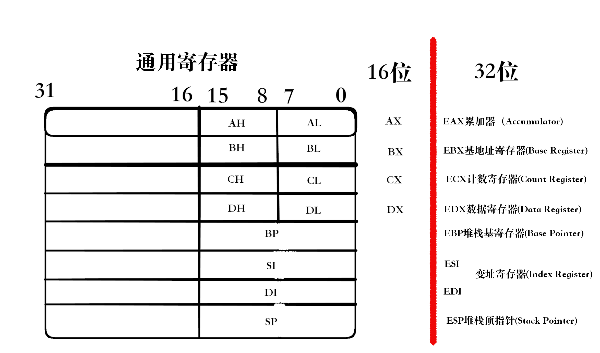

# X86 CPU的寄存器

### 段寄存器

| 简写   | 中译名           | 英文术语               | 值             |
| ------ | ---------------- | ---------------------- | -------------- |
| **CS** | **代码段寄存器** | Code Segment Register  | 代码段的值     |
| DS     | 数据段寄存器     | Data Segment Register  | 数据段的值     |
| ES     | 附加段寄存器     | Extra Segment Register | 附加数据段的值 |
| **SS** | **堆栈段寄存器** | Stack Segment Register | 堆栈段的值     |
| FS     | 附加段寄存器     | Extra Segment Register | 附加数据段的值 |
| GS     | 附加段寄存器     | Extra Segment Register | 附加数据段的值 |

### CPU在实际取指令时根据CS:EIP来准确定位一个指令。

#### 标志寄存器  EFLAGS register

### 现在主流的计算机都是64位。

#### X86_64 寄存器

#### 64位和32位在核心机制上差别不大。

