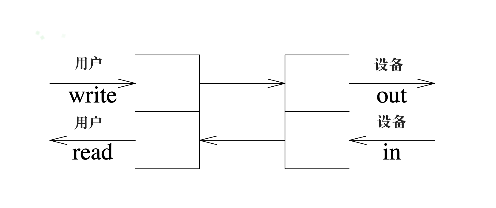
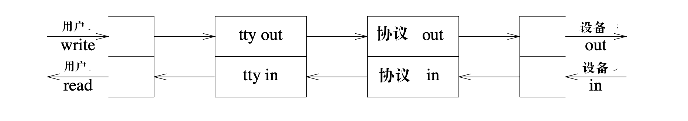
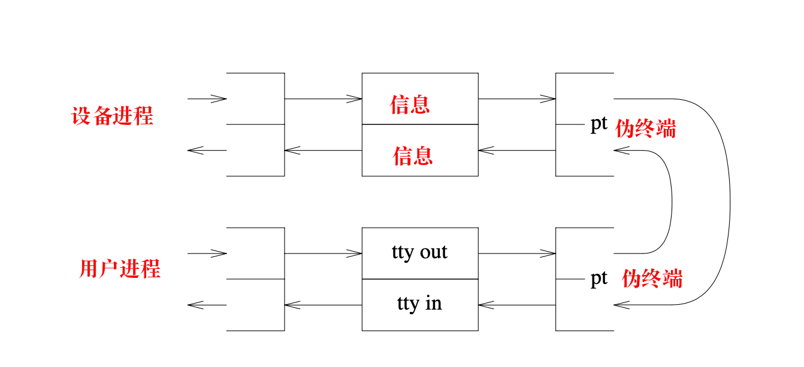

重印自《AT&T贝尔实验室技术期刊 63期,8号第二部分》（1984年10月)。当前流的实现机制与此处描述的稍微有些不同，但结构仍保持一致。Copyright © 1984 AT&T.

### 																											 									  一个流输入-输出系统

​																	*Dennis M. Ritchie*

#### 											         																		简介

​	     在新版的**Unix**操作系统中，灵活的**基于协同程序的设计**<u>替代了</u>**进程和终端**(或**网络**)间的**传统刚性连接**。**处理模块**可以<u>被动态插入</u>到**流**中，该**流**连接了**用户程序**和**设备**。通过提供**进程间通信**，程序之间也可直接连接。

#### 引言

​	     **Unix操作系统**中处理**终端**和**其他字符设备**的那部分<u>始终都很复杂</u>。在Unix系统的最近版本中，它已变得更为复杂了，这有两个原因:

1).**网络连接**要求**协议**比现有结构中所容纳的协议更为**繁杂**。"行规程"的概念只是部分成功，主要是因为在传统的系统中，一次只能有一个行规程处于活动状态。

2).**传统字符I/O系统**的基本数据结构——**单个字符的队列**(即"clist")——成本很高，因为它一次只能接收和分配一个**字符**。尝试通过**整个绕过机制**或**引入临时例程**来避免开销，并**成功加速代码**，但却要付出**牺牲规则性**的**代价**。

针对特定问题的**拼凑解决方案**正在摧毁系统这部分的**模块化**。重做这一切的时机已然成熟。本论文描述了新的结构。

​	  此处描述的系统运行在贝尔实验室信息科学研究部的大约20台机器上。虽然它正在被贝尔实验室的其他部门研究，它还没有普遍可用。

#### 综述

​	这部分总结了新I/O系统的**术语、组件和机制**。

##### 流

​	**流**是用<u>户进程和设备(或伪设备)之间</u>的**全双工连接**。它由数个<u>线性连接</u>的**处理模块**组成，除了**数据双向流动**外，它和shell管道类似。流中的**模块**通过把信息传递给**与其相邻的模块**进行几乎**排他的通信**。除了用于流程控制的一些常用变量，**模块**并不需要访问**相邻模块**的**存储**。此外，**模块**只向每个**相邻模块**提供唯一一个**入口点**，即接收信息的例程。

​	**流**中<u>最接近进程的**那端**</u>是**一组例程**，它用于向系统的其他部分**提供接口**。用户的**写和I/O控制请求**被转换为**发送给流的信息**，**读请求**从流中获取数据，并把它传递给用户。在流的**另一端**是**设备驱动模块**。此处，来自流的数据被发送给设备；设备检测到的**字符和状态变换**被组合成**信息**，并发送到**用于用户程序的流**。中间模块以多种方式来处理信息。

​	 当打开设备后，流里**两端的模块**<u>自动连接</u>；**中间的模块**可根据用户程序的请求**自动附加**。流处理模块是对称的，它们的**读和写接口**是相同的。

##### 队列

​	  每个流处理模块由**一对队列**构成——每个**方向**一个(一个用于**输入**，另一个用于**输出**)。队列不全由**数据队列**构成，还包含**两个例程**和一些**状态信息**。一个例程是**put过程**，它由其邻居调用，来将信息放在**数据队列**中。另外一个例程是**service过程**，无论何时有需要它做的工作，都会调度它执行。状态信息包括<u>指向下游的下一个队列</u>的**指针**，各种**标志**，指向队列实例化所需的其他状态信息的**指针**。以这样的方式分配队列，使得**与流模块的一半相关联的例程**可以找到**与另一半项关联的队列**。(例如，这用于生成终端输入的回显。)

##### 信息块

​		在**队列间传递的对象**是从分配器获取的**块**。每个块都包含一个read指针，一个write指针和一个limit指针，它们分别指定被传递信息的**起始**，**结束**和write指针**可增加范围的界限**。

​        块的**头部**指定了它的类型；最常见的块包含**数据**。也存在着多种类型的**控制块**——它们的格式和数据块相同，且从同一个分配器获取。例如，有以下几种控制块：把界定符引入数据流；传递用户I/O控制请求；声明特殊的情形(如终端设备的线路终端和载波丢失)。

​		虽然数据块以**离散的单位**到达处理模块，它们之间的界限在语义上是无关紧要的；标准子例程会尝试<u>合并</u>同一个队列中的**相邻数据块**。但是，控制块永远不会被合并。

##### 调度

​      虽然每个**队列模块**在某些方面表现地*像*一个**独立的进程**，但它<u>不是</u>一个真正的进程；对于**未运行的队列模块**，系统*不会保存***状态信息**。特别是当队列处理例程<u>不能继续执行时</u>，它们不会阻塞，一定要**显式地返回控制**。可以通过以下描述的机制**启用队列**。当一个**队列**变得可用后，系统会在合适的时机尽早调用它的**service过程**入口——它会从相关的**数据队列**中清除后继的块，处理它们，并通过调用**当前队列的put过程**,把它们放置在下一个队列中。当不再有需要处理的块，或下一个队列满了时，**service过程会返回至系统**。任何特殊的状态信息都必须显式保存。

​	  标准例程大多自动地**启用队列模块**。例如，如果**队列为空**，在队列上放置块的例程会启用**队列服务例程**。

##### 流控制

​	 和每个队列相关联的是**一对**用于**流控制**的数字。**高水位标示**限制了队列中**尚未处理的数据量**；依照惯例，模块不会在**队列**里放置<u>超过其限制</u>的数据。**低水位标示**用于以这种方式进行调度：当一个队列已经超过它的高水位标示时，会设置一个**标志**。然后，当从**数据队列**中获取**块**的例程注意到该**标志**被设置，且**该队列**已经降到了**低水位标示**以下时，就会启用当前队列的**上游队列**。

#### 简单示例

​		图1描述了**已经被打开**的一个**流设备**。**上层的例程**——绘制在左边的一对**半开的矩形**——由用户的read和write调用所调用。**写入器例程**<u>发送信息</u>到图右所展示的**设备驱动器**。来自设备的**数据**被组合成发送给**上层读取器例程**的**信息**——当**用户进程**执行read调用时，**上层读取器**会返回数据给它。




##### 													图1.设备打开后的配置


​			图2展示了用RS-232线连接的一个普通终端。这里插入了一个处理模块(中间的那对矩形)；它执行使终端可用的服务，例如**回显**、**字符擦除**和**换行**，**按需制表符扩展**及**回车与换行之间的转换**。可以在多个**终端处理模块**中选一个使用。**标准的终端处理模块**提供了类似于第七版系统中的那些服务，另一个类似于伯克利"新tty"驱动程序[2]。


##### 																图2.正常的终端连接配置

流中的**处理模块**被认为是顶部（图2左边所示）接近用户程序的**栈**。因此，为了在打开终端设备后安装**终端处理模块**，进行此类连接的程序执行了一个**"push" I/O控制调用**，命名相关的**流**和**所需的处理模块**。其它的原语从栈中弹出一个模块，并决定了最上层模块的名称。

​		大多数使用**在此处描述的操作系统版本**的**机器**被连接到基于**Datakit数据包交换机**的**网络**。虽然网络上有许多主机接口，但我们的大多数接口都是原始接口，要求由**主机**，而非前端处理器来*执行***网络协议**。因此，当通过网络把终端连接到一个主机时，使用如图3所示的配置；**终端处理模块**被堆叠在**网络协议模块**之上。同样可以选择协议模块——**当前的标准协议**和**正在被逐步淘汰的旧协议**皆可。




##### 																			图3.网络终端配置

当网络用于**文件传输**或**不需要终端处理的其他目的**时，使用**第四种常见的配置**(未用图标展示)。它仅省略了"tty"模块，并只使用协议模块。另一方面，我们的**一些机器**<u>有</u>可以执行标准网络协议的**前端处理器**。这里，**用于远程文件传输的连接**将类似于图1的连接——因为协议是在**操作系统之外**处理的；同样，经由前端的**网络终端连接**将如图2所示被处理。

##### 信息

​		模块间的大多数**信息**都包含**数据**。分配信息块的**分配器**接收一个参数，该参数指定了**此分配器的调用者**将接受的最小块。当前分配器维护着一个**块的清单**，这些块的长度为4、16、64和1024个字符。 分配块的模块通过平衡**块链接开销中的空间损失**和**块里的未使用的空间**，来选择**块的大小**。例如，**上层的write例程**请求64字符或1024字符长的块，因为这种调用通常**传递许多字符**；网络输入例程分配16字节的块，因为数据以那一大小的数据包抵达。最小的块只用于**传递参数**给以下讨论的**控制信息**。

​		除了数据块，还有数种类型的**控制信息**。为了确保**以下信息**在合适的时间生效，它们与**数据信息**一起排队。

BREAK      	 是由**终端设备**在检测到**换行符信号**后生成的。**标准终端输入处理器**把这一信息转换为一个**中断请求**。					   它也可以被发送给**终端设备驱动程序**以使其在**输出线**上产生中断。

HANGUP   	当设备的<u>远程连接断开</u>时由**设备**生成。当信息抵达上层时，它被转换为**进程**的一个中断，该信息也					   标记了流，所以进一步尝试使用**该流**会**返回错误**。

DELIM     	  是数据中的一个定界符。大多数的**流I/O系统**准备提供**真正的流**，在这些流中<u>记录边界</u>是无关紧要					   的，但也有值得**界定数据**的多种情形。例如，终端输入一次只读一行；**终端输入处理器**生成DELIM					   信息以划分**行之间**的界限。

DELAY           告诉**终端驱动程序**在输出上生成一个**实时的延时**；它容许**慢速终端**对先前发送的**字符**做出反应。

IOCTL			该信息是由用户的**ioctl系统调用**生成的。在上层收集相关的参数，若在那里**请求未被理解**，该**请求					  及其参数**被组合成一个**信息**，并被沿着**流**向下发送。第一个理解了该特定请求的**模块**对其进行操作，					  并返回一个**肯定的应答**。未识别特定IOCTL请求的**中间模块**将其**向后传递**；**流末尾的模块**返回一个**否					  定的应答**。**上层例程**等待**应答**，并把它携带的所有信息<u>返回给</u>**用户**。

其他的**控制信息**是**异步**的，并跳过了**排队的数据**和**非优先的控制信息**。

IOCACK

IOCNAK        应答IOCTL信息。**流的设备端**必须用这两个信息中的一个来应答；如果**没有收到响应**，**上层**最终会**超时**。

SIGNAL        该信息是由**终端处理模块**生成，并使得上层生成类似于*quit*和*interrupt*的**进程信号**。

FLUSH    	  该信息用于在**信号发生**或**收到用户请求后**，从输入和输出队列中**丢弃数据**。

STOP

START		  **终端处理器**使用该信息来停止或重启**设备的输出**，例如，用于实现传统的 control-S/control-Q (X-					 on/X-off)**流控制机制**。

##### 队列机制和接口

​		有如下格式的**队列数据结构**（为了阐述稍微进行了一些简化）和**全双工流模块**的每个方向都相关。

```
struct queue {
	int flag;    					/* 标志位  */
	void (*putp)();				/* put过程 */
	void (*servp)();   		/* service过程*/
  struct queue *next;    /* 处于下游的下一个队列*/
  struct block *first;   /* 队列中的第一个数据块*/
  struct block *last;		 /* 队列中的最后一个数据块 */
	int hiwater;					 /* 队列中的最大字符 */
	int lowater;					 /* 队列耗尽时的唤醒点 */
	int count;						 /* 当前队列中的字符 */
	void  *ptr;						 /* 指向私有存储的指针 */
};
```

​		flag字段包含数个**标志位**，底层例程用这些**标志位**来控制调度，它们显示了**下游模块**是否希望读取数据，**上游模块**是否希望写入，或者**队列**是否已经启用。上游模块检查某个**标志位**——它指示了该**队列**是否已满。

​		成员**first**和**last**指向组成了**整个队列**的**数据和控制块单链表**的头部和尾部；当创建了队列后，会初始化**hiwater**和**lowater**，当和count（当前队列的大小）相比较时，来确定**队列**是否已满，是否已经足够空以启用一个被阻塞的**写入程序**。

​        成员ptr储存了一个**无类型的指针**——**队列模块**可使用该指针来追踪它的**私有存储**的**位置**。例如，**终端处理模块**的每个实例化都维护一个**结构体**，该结构体包含多种**模式位**和**特殊字符**；ptr储存了一个指向这个结构体的指针。ptr的类型是人为指定的。**ptr**也可以是**指针**的**联合(union)**——每个**指针**都指向**可能的模块状态结构体**。

​		可在**两种通用方式**中**选择一种**来编写**流处理模块**。在那种**简单的方式**中，**队列模块**几乎充当了经典的**协同例程**。当**流处理模块**被实例化时，它将它的put过程putp设置为系统提供的**默认例程**，并提供了一个**service过程**servp。流处理模块的**上游模块**通过调用该模块的**putp例程**来处理**块**——**putp例程**通过操作**first**和**last**指针来把**块**放置在**该模块的队列**中。标准put过程也会**启用当前模块**；**调度器**会在一小段儿时间后，调用当前模块的**service过程servp**。典型的**service例程**的可用如下伪代码概述:

`service(q)`

`struct queue *q`

​			`while(q 不为空 且 q->next 没有满){`

​					`从q中获取一个块`

​					`处理信息块`

​					`调用q->next->putp来处理新块或变换后的块`

​			`}`

在**信息**可以**被相互独立处理**的情形下，这种机制是合适的。例如，**终端输出模块**使用了这种**机制**。所有的**调度细节**都由**标准例程**处理。

​		**更复杂的模块**需要更为精细地*控制***调度**。**终端输入**是一个好的示例。此处上游的**设备模块**产生字符，通常一次一个，这些字符必须被**收集成一行**以允许**擦除字符**和**终止处理**。因此，流输入模块提供了一个**put过程**，供**设备驱动程序**或**下游的其他模块**调用；以下是**这个例程**及其附随的**service过程**的伪代码概述:

`putproc(q,bp)`

`struct queue *q;struct block *bp;`

​			`把bp放入队列q`

​			`回显bp指向数据里的字符`

​			`if(bp指向的数据中包含换行或回车)`

​					`启用队列q`

`service(q)`

`struct queue *q`

​			`从队列q中获取数据，直到遇到换行或回车，`

​					`处理擦除和终止字符`

​					`调用q->next->putp来把该行(line)传递给上游队列`

​					`调用q->next->putp，并传入DELIM信息`

**put过程**会尽快生成**回显字符**；当**终端模块**被附加到一个**设备处理程序**时，在来**自设备的输入中断**期间，会创建这些**回显字符**，因为**put过程**是作为**设备处理程序**的子例程调用的。另一方面，行收集、擦除和终止处理——可能很耗时——都是在service过程**处于低优先级时**完成的。

##### 和系统其他部分的连接

​	 虽然用于**中断和网络设备**的**所有驱动程序**和**所有协议处理程序**都被重写了，但**系统的其他部分**只需要很小的改动。 Thompson [4]所描述的**字符设备**和**字符设备开关**依旧存在。**字符设备开关**中的一个指针——如果该**指针为null**，会使系统像通常一样对待设备；例如，它用于原始磁盘和磁带。如果该**指针不为null**，而是指向用于**流设备**的**初始化信息**，当打开一个**流设备**，会创建如图1所示的**队列结构**，使用这一**初始化信息**，指向**为流命名的结构体**的指针被保存(在"inode表"中)。

​		随后，当用户进程执行**read,write,ioctl或close调用**时，**非null流指针**的存在指挥系统使用一系列的**流例程**以生成和接收**队列信息**；这些是之前提及的"上层例程"。

​	  **用户层的代码**只需改变很少一部分，主要是因为**打开一个终端**就将其置于图1所示的**"非常原始"的模式**。为了安装**终端处理句柄**，有必要让像init一样的程序来执行合适的**ioctl调用**。

##### 进程间通信

​		如前所述，**流I/O系统**构成了**用户进程**和**设备**间的**灵活通信路径**。只需**增加一小部分**，它也提供了**进程间通信**的机制。一种**特殊设备**，**"伪终端"（"pseudo-terminal"）或PT**，连接了进程。**PT文件**以**奇-偶对的形式**出现；写在"奇-偶对"**奇数成员**上的**数据**，将作为**偶数成员**的**输入**出现，反之亦然。这一想法并不新鲜，例如，它出现在Tenex[5]及其后继的系统中。它类似于管道，尤其是命名管道。**PT文件**与传统的**管道**有两点不同:它们是**全双工的**，且控制信息像**数据**一样通过它们。它们不同于常见的**伪终端文件[2]**——内部并未附加任何常见的**终端处理机制**;它们是纯粹的**控制和数据信息发送端**。**PT文件**足以设置一个合理的**通用机制**，用于显式的**进程通信**，但它们本身并不是特别有趣。

​		特殊的**信息模块**提供了更新奇的**可能性**。在一个方向上，**信息处理器**获取**控制和数据信息**（如前所述），并把它们转化为**数据块**，这些**数据块**以提供了**信息类型**的**头部**开始，其后紧跟着**信息内容**。在另一个方向上，**信息处理器**解析类似结构的**数据信息**，并创建对应的**控制块**。在**图4**展示的配置中，一个**用户进程**通过**终端模块**、**PT文件对**和**信息模块**与模拟了**设备驱动程序**的另一个**用户级进程**通信。因为**PT文件**是透明的，且**信息模块**在**设备进程数据**和**流控制信息**之间进行了**双射映射**，该设备模拟器**可能完全忠实于时序细节**。特别是，用户的**ioctl请求**被发送给**设备进程**并由其处理，即使这些请求**不被操作系统所理解**。



##### 																		图4.  设备模拟器配置

​		这个配置的用处与其说**模拟了新设备**，毋宁说提供了让**某个程序**控制**另一个程序**环境的方式。Pike [7]展示了怎样用这些**机制**在一个**物理终端**上创建多个**虚拟终端**。在另外一个应用中，**机器间的连接**(一台计算机上的用户登录到另一台计算机)使用了这一**信息模块**。此处，远程计算机上的程序生成的**ioctl请求**，被这一模块转换为可以沿网络发送的**数据信息**。**本地调出程序**再把这些**数据信息**转换为**终端控制命令**。

#### 评价

我**重写字符I/O系统**的意图是通过以下方式**改进其结构**:1.*分离*已经**交织在一起的功能**。2.允许**独立的模块跨定义良好的接口**动态连接。我也想使系统变得更快和更小。这个项目最困难的部分是**接口的设计**。它由以下**决策**所指导:

1) 为了**提高效率**，在模块之间**传递的对象**必须是**数据块的引用**。这一原则的**最重要的结果**(以及那些**被证明有决定性的结果**)是，当数据**跨模块接口传递**时不需要被复制，且在**单个模块间传输**时可以**处理多个字符**。另一个**不利但是公认**的效果是，**每个模块**都必须准备好处理**不可预测大小的离散**数据块。例如，一个期望包含**8字节头部的记录**的**协议**必须准备好*拼接小的**数据块***，并*分离一个包含**头部和后续数据的块***。一个**相关的**（虽然**不必是作为结果的）决策**,是使得代码认为**该数据是可寻址的**。

2) 我遗憾地决定，每个**处理模块不能作为**一个**有自己调用记录**的**独立进程**。数字似乎与之相反：在大型系统上，很有必要允许**多达1000个队列**，但我没找到好方法来**运行这么多进程**，却**不消耗过多的存储**。作为结果，<u>不允许</u>**流服务器过程**阻塞起来**等待数据**，相反，在显式保存了**必要的状态信息**后<u>必须返回</u>。在实践中，代码所费的周折很少有严重的，但如果可以用真正的**协同例程风格**来将服务器编写为**简单的读-写循环**，方案的**优点将会增加**。

3) **服务器的设计特性**和**put过程**是最难于实现的。起初，我有这样的**信念**——**读和写方向**的**跨模块接口**应该是相同的。接着，我观察到，**纯粹的调用模型**(只有put过程)将不会生效，在**某一时刻必须排队**。例如，如果通过**终端处理模块**调用**系统条目**，将其写入**设备驱动程序**，则**该驱动程序**需要在内部**对字符排队**，以免输出完全同步。另一方面，**纯粹的队列模型**(*只有service过程*；上游的模块始终将它们的**数据**放置在**输入队列**中)**也显得不切实际**。如前所述，某个**模块**(如终端输入)必须经常在**依赖其输入数据**的**时间点**激活。

​       在对**细节**的大量炮制后，此处提出的**模型**就**浮现**出来了。通过**多种测量**，它的**性能**通常可以符合期望。

​		模块化的改进难于测量，但似乎确有成效；例如，**流模块**中包含的**头文件数目**降到了**基础系统(4.1BSD)**中**相似例程**所需的**大约一半左右**。当然，相较于旧系统中的"**行规程**"来说，**流模块**可以*被更自由地组成*。

​	    此处描述的操作系统版本的**程序文本大小**在VAX上**大约是106千字节**；**基础系统**大约是**130KB**。这一减少是通过以下**途径**实现的：1.重写多种**设备驱动程序**和**协议**；2.**去除**第七版系统的**多双工文件**[1]——这些文件的**大多数函数**(虽然并非全部)被归入**其他机制**中。另一方面，**数据空间**已经增加。在为32个用户配置的**VAX 11/750** 上，大约有**32KB的空间**用于存储**流、队列和块**的结构。**传统的字符列表**似乎需要的**空间**更少，来自**伯克利**和 **AT&T** 的相似系统使用的空间在**14到19KB**之间。程序对**数据**的折中看起来可取。

​	    因为难以找到**类似的配置**，到目前为止还未做出**正规的时间比较**。在 **VAX 11/750**上，使用**此处描述的系统**，在一个**直接连接的终端**上打印一个大文件，每个字符**消耗346毫秒**；这比**基础系统**大约慢10%。另一方面，那个系统的**每字符中断例程**是用汇编语言编写的，并且它的**终端处理程序**的其余部分充满了**不可移值的内插汇编代码**；而当前的系统**完全是用C语言编写的**。在通过**原始网络接口连接的终端**上打印同一个文件，每个字符需要**136毫秒**——这是旧网络例程的一半。Pike[7] 观察到，在**Blit连接软件**的三个实现中，**基于流系统的那一个实现**是唯一一个可以通过**19.2Kbps连接**，**以接近线路速度的速度**下载程序的软件。总的来说，我得出一个结论，新的代码结构**没有过多地减慢**类似任务的**速度**，有时可能显著提升速度。

​		虽然这个**新的代码结构**运行良好，但它由一些**独特性**和**局限性**——有一些似乎是内在的，一些是可修复的，还有一些是当前工作的主题。在**为用户返回结果**之前，**I/O控制调用**转变为**需要应答的信息**。有时，**该信息**最终会转到**可能缓慢应答**或**永不应答**的**用户级进程**。为了**不必确定**哪个进程获取哪个应答，直到应答返回，这个流都是**写锁定的**。超时会解除锁定，所以如果**应答延迟**，会返回不合理的错误；若**应答丢失**，到导致**长的锁定期**。该问题可用通过**更加努力地解决它**进行改善，但它代表了**这一类错误**——它们会在**直接调用**被**信息传递方案**替换时出现。

​		因为花费在**服务器例程**上的时间无法被分配给**任何特定的用户**或**进程**，所以会出现一些**奇怪的情形**。例如，不可能让**设备**支持**特权ioctl调用**，因为**设备**不知道谁产生了这个**信息**。**记帐**和**调度**变得不太精确；对一些系统的**简单统计**显示，**4%-8%**的**非空闲CPU时间**被花费在了**服务器例程**上。最后，**服务处理的匿名性**必定使**测量新I/O系统的性能**更加困难。

​		当前形式的**流I/O系统**是**纯数据驱动**的。即，通过用户的**write调用**来**呈现数据**，并将其**传递给设备**；相反，**数据**似乎从**设备**那里**不请自来**，并被传递给**上层程序**——**数据**在那里被**read调用**所拾取。在任何情况下，**流控制**都会**抑制数据的快速生成**，但除了**流的消费端**，没有地方精确知道**需要多少数据**。考虑一个命令在**由流连接的另一台机器**上执行可能的**交互式程序**。最简单的这类命令**设置了连接**，并调用了**远端的程序**，之后从它自己的**标准输入**复制**字符**到**流**，并从**流**复制**字符**到它的**标准输出**。这个方案足够实用，但当用户键入的**字符数**多于**远端程序的期望值**时，该方案就会失灵。例如，如果**远端程序**压根没有**读取输入**，任何**之前键入的字符**被发送给**远端系统**，然后就**丢失**了。这展示了一个问题，但我知道**流I/O机制内部**没有解决方案，必须采用其它的想法。

​		**流本身**是**线性连接**；它们不支持**多路复用**、**扇入**或**扇出**。除非处在**流的两端**，否则**每个模块的调用**都有一个唯一的"**next**"和"**previous**"模块。**流**的两个局部重要应用证明了**多路复用**的重要性:1.**Blit终端连接**——在这个应用里，**用户程序**很好地实现了**多路复用**(虽然以牺牲了一些性能为代价)。2.通过网络**远程执行命令**——在该应用中，期望分离**标准输出**和**错误输出**(虽然现在实现它有些困难)。似乎**通用多路复用机制**在这两种情形中都有帮助，但到目前为止，**我也不知道怎样设计它**。

​		虽然当前的**设计**提供了**优雅的方式**，用于控制**已经打开的通信通道**的语义，但它缺乏建立**进程间通道**的通用方法。以上描述的**PT文件**适用于**Blit层**，也足以应对一些**管理员控制的**客户端-服务器关系。(是的，我们有**多机mazewar**。)然而，需要更好的**命名机制**。

​	    尽管有这些限制，**流I/O系统**运行良好。它旨在**改进设计**而非**增加功能**，我有个信念——**有了合理的设计，自然能轻松实现功能。**这一方法虽然费劲，但终会成功。

### 参考文献

1. *Unix Programmers’s Manual, Seventh Edition,* Bell Laboratories, Murray Hill, NJ, (January, 1979).

2. *Unix Programmer’s Manual, Virtual VAX-11 Version,* University of California, Berkeley (June

   1981).

3. A. G. Fraser, ‘‘Datakit--A Modular Network for Synchronous and Asynchronous Traffic,’’ *Proc. Int.*

   *Conf. on Communication,* Boston, MA (June 1979).

4. K. Thompson, ‘‘The Unix Time-sharing System--Unix Implementation,’’ B.S.T.J. **57** No 6, (July-

   Aug 1978), pp. 1931-1946.

5. D.G. Bobrow, J.D. Burchfiel, D.L. Murphy, and R.S Tomlinson, ‘‘Tenex--a Paged Time Sharing

   System for the PDP-10,’’ C. ACM **15** No. 3, (March 1972), pp. 135-143.

6. T.A. Dolotta, S.B. Olsson,, and A.G.Petrucelli, *Unix User’s Manual, Release 3.0,* Bell Laboratories,

   Murray Hill, NJ (June 1980).

7. R. Pike, ‘The Blit: A Multiplexed Graphics Terminal,’’ AT&T Tech. J. **63** No. 8 Part 2, October 1984.


### 译者注:原论文链接——https://cseweb.ucsd.edu/classes/fa01/cse221/papers/ritchie-stream-io-belllabs84.pdf


